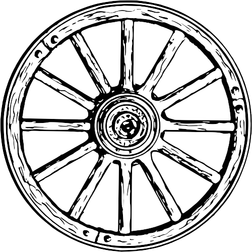

<p align="center">
    
</p>


<h1 align="center">Scooter</h1>

<h3 align="center">Scrolling Animation jQuery Plugin</h3>


## Introduction

Scooter is a jQuery plugin which allows you to scroll to any part of the page in style by just calling the `scoot()` function with the `id` or `classname` of the element at the target scrolling position. It contains various options to customize the style of scrolling, scroll speed and many scrolling Styles.

## Utilize

You need two things for this plugin to work, one is "jQuery library" and the other `scooter.js` file.

Just include the `scooter.js` file after the "jQuery library" as shown in the code snippet below and you're done.

NOTE: The only dependency for this plugin to work is jQuery library.

```html
<html>
    <head>
        <script src="//ajax.googleapis.com/ajax/libs/jquery/1.8.3/jquery.min.js"></script>
        <script src="scooter.js">
    </head>
    <body>
        <div id="section-1">This is the element where you want to scroll to<div>
        
        /*
         * You may call the function like this
         * (but better attach an event listener)
         */
        <a onclick="$('[jquery selector]').scoot([options]);">Go to Element</a>
    </body>
</html>
```

> ![NOTE]\
> There are two js files, if you do not want the various easing effects, you can use the `scoot.noeasing.js`

## Parameters

The `scoot` function has 6 options:

1. [easing](#easing)
2. [scrollSpeed](#scrollSpeed)
3. [padding](#padding)
4. [element](#element)
5. [onScrollStart](#onScrollStart)
6. [onScrollEnd](#onScrollEnd)

#### easing (*default*: ```easing```)

This option defines the scrolling style. The various easing effects supported can be seen at www.easings.net (Accepts string only)

#### scrollSpeed (*default*: ```400```)

Controls the scrolling speed, higher is the number slower is the scroll speed (Accepts only number)

#### padding (*default*: ```0```)

Adjusts little ups and downs in scrolling. Suppose a small amount of padding is applied to a particular element due to which the scroll didn't end at the right position, so this option helps you to rectify (Accepts numbers only, can be negative)

#### element (*default*: ```html, body```)

**Added in v1.0.5**.
The element in which you want this plugin to work. Default is "body". (Accepts any jQuery/CSS selector)

#### onScrollStart

**Added in v1.0.7**.
A function to be called before scrolling starts

#### onScrollEnd

**Added in v1.0.7**.
A function to be called after the scrolling ends completely with animations

To add an option:

```javascript
$('[jquery selector]').scoot({
  <optionName> : <optionValue>
});
```

## Easing Effects

This plugin supports more than 30 different styles of scrolling. The easing option lets you choose a particular style of scrolling according to your choice.

The different easing effects are:

<pre>
<code>swing, easeInQuad, easeOutQuad, easeInOutQuad, easeInCubic, easeOutCubic, easeInOutCubic, easeInQuart,
easeOutQuart, easeInOutQuart, easeInQuint, easeOutQuint, easeInOutQuint, easeInSine, easeOutSine, easeInOutSine,
easeInExpo, easeOutExpo, easeInOutExpo, easeInCirc, easeOutCirc, easeInOutCirc, easeInElastic, easeOutElastic,
easeInOutElastic, easeInBack, easeOutBack, easeInOutBack, easeInBounce, easeOutBounce, easeInOutBounce</code>
</pre>


## License

This plugin is licensed under the MIT License, for more information check out the `LICENSE` file.
